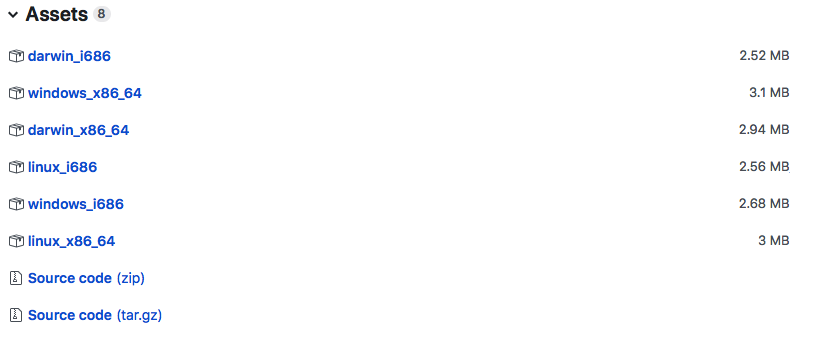

ecpluginbuilder
===============
A simple build tool for plugins based on PluginWizard

## Install

- Find an asset corresponding to your platform:
. For 32-bit platforms please use version i686.
- Download the asset and rename it to ecpluginbuilder or ecpluginbuilder.exe for Windows.
- Optionaly add path to the ecpluginbuilder folder into PATH environment variable.

## Usage

    ecpluginbuilder -plugin-version 1.0.0.2 -folder t,META-INF,lib,dsl,pages,htdocs -plugin-dir <path-to-plugin>

    or

    cd <plugin folder>
    ecpluginbuilder

The utility will read plugin name and version from plugin.xml, if not provided.

### Show Help

    ecpluginbuilder -help

### Options

* dependency-chunk-size: Dependencies chunk size in bytes (default it 1 MB). Used for plugin with dependencies (lib folder)
* folder: list of folders to pack. By default all folders from the plugin directory except 'lib' will be packed.
* increment-build-number: flag. If set, new build number will be generated by incrementing current build number.
* pack-jar: flag. If set, the result plugin will have .jar extension.
* plugin-dir: plugin directory. If not provided, current directory will be used.
* plugin-name: the name of the plugin. If not provided, will be taken from META-INF/plugin.xml.
* plugin-version: the version of the plugin. If not provided, will be taken from META-INF/plugin.xml.
* preserve-build: if set to false, the existing build directory will not be cleaned up.

## Development
### Requirements
- Go
- make or emake

### Setup
- Set the GOPATH environment variable to tell the Go tool where your workspace is located.
- `go get github.com/electric-cloud/ecpluginbuilder`
- `cd $GOPATH/src/github.com/electric-cloud/ecpluginbuilder`
- `emake` or `make`
